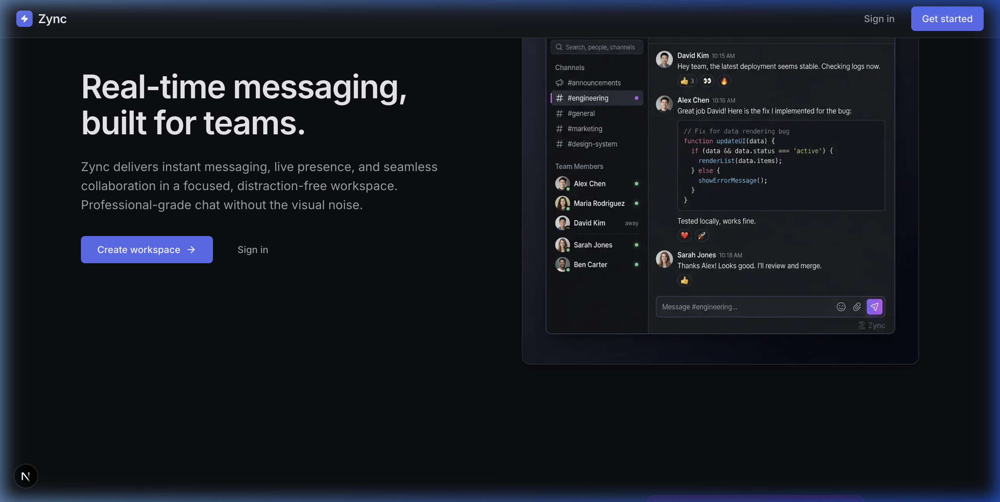
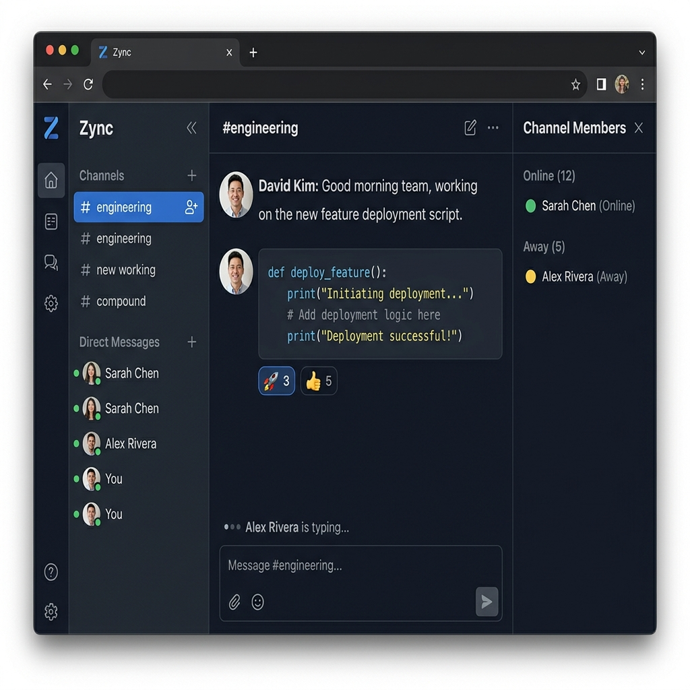
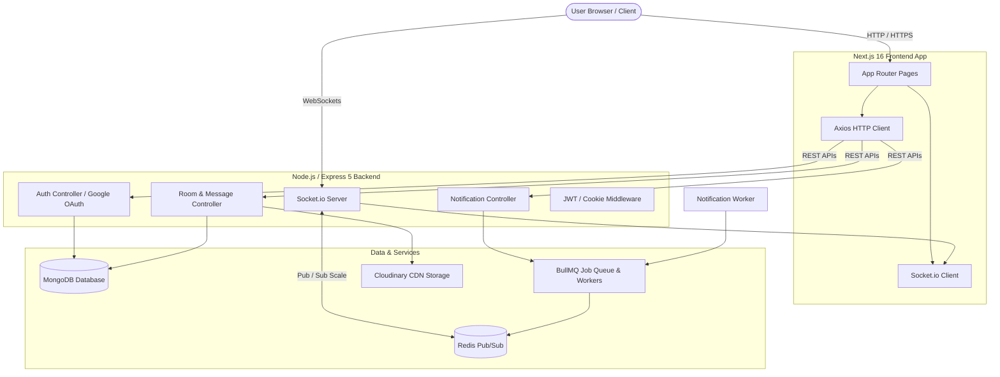

# ⚡ Zync — Enterprise-Grade Real-Time Team Messaging Platform

[](https://nextjs.org/)
[](https://reactjs.org/)
[](https://www.typescriptlang.org/)
[](https://expressjs.com/)
[](https://www.mongodb.com/)
[](https://socket.io/)
[](https://redis.io/)
[](https://bullmq.io/)

**Zync** is a modern, high-performance, real-time team collaboration and messaging application designed for seamless communication, low latency, and scale. Built with a Next.js 16 (App Router) frontend and a Node.js/Express TypeScript backend powered by Socket.io, Redis Pub/Sub, and MongoDB, Zync provides focused, distraction-free team workspace chat with rich media, presence tracking, message threading, reactions, and background job queues.

---

## 📸 Screenshots

### 1. Landing Page & Hero Section
Modern dark-themed landing page with product features, live UI preview, and instant navigation.


---

### 2. Workspace & Real-Time Chat Interface
Feature-rich real-time messaging interface with organized channels, direct messages, online presence indicators, code snippet formatting, emoji reactions, message threading, and member panels.


---

### 3. Authentication & OAuth Integration
Secure authentication flow supporting email/password credentials and Google OAuth 2.0 single sign-on with HTTP-only cookies.

---

## ✨ Key Features

- 💬 **Real-Time Instant Messaging**: Low-latency bidirectional socket communication powered by Socket.io and scaled horizontally with Redis Adapter.
- 📢 **Public & Private Channels**: Create topic-specific channels or private team rooms with role-based access controls and invite link generation.
- 👤 **Direct Messaging (DMs)**: One-on-one encrypted-style private conversations with online/away/offline status indicators.
- 🟢 **Live Presence & Typing Indicators**: Real-time user status sync (`online`, `idle`, `away`, `offline`) and dynamic typing indicators in active chats.
- 📎 **Rich Media & File Attachments**: Upload images, documents, and assets powered by Cloudinary with instant image preview modals.
- 📌 **Message Pinning & Starred Messages**: Pin important announcements or star messages for quick access in a dedicated side sheet panel.
- 😀 **Emoji Reactions & Threaded Replies**: Express reactions with emoji pickers and keep conversations organized with message threads.
- 🔐 **Dual Authentication**: Secure login using JWT stored in `httpOnly` secure cookies, alongside native Google OAuth 2.0 integration.
- 🔔 **Asynchronous Notification Queue**: Background job execution powered by BullMQ & Redis for offline user alerts and system notification dispatches.
- 🌓 **State-of-the-Art Dark Theme UI**: Built with custom design tokens, smooth micro-animations, glassmorphism elements, and responsive layout.

---

## 🏗️ Architecture Overview

Zync utilizes a decoupled client-server architecture designed for high availability and low latency.



---

## 📁 Repository Structure

```
Zync/
├── backend/                  # Node.js + Express + TypeScript Backend
│   ├── src/
│   │   ├── config/           # Database & environment configurations (MongoDB)
│   │   ├── helpers/          # Shared helper utilities & formatters
│   │   ├── jobs/             # BullMQ queue definitions
│   │   ├── lib/              # Redis client connection & Cloudinary setup
│   │   ├── middleware/       # Authentication & request validation middleware
│   │   ├── models/           # Mongoose schemas (User, Room, Message, Notification)
│   │   ├── routes/           # REST API routes (Auth, Room, Notification)
│   │   ├── socket/           # Real-time socket handlers (Presence, Message, Room)
│   │   ├── types/            # TypeScript interface definitions
│   │   └── workers/          # BullMQ background notification workers
│   │   └── server.ts         # Server entry point & CORS configuration
│   ├── package.json
│   └── tsconfig.json
│
├── frontend/                 # Next.js 16 + React 19 Frontend App
│   ├── app/
│   │   ├── auth/             # Login, Signup, and OAuth Callback routes
│   │   ├── chat/             # Real-time chat workspace interface & components
│   │   ├── invite/           # Shareable invite link acceptance page
│   │   ├── globals.css       # Global design tokens & dark theme styles
│   │   ├── layout.tsx        # Root layout with context providers
│   │   └── page.tsx          # Landing page with hero & features
│   ├── public/               # Static assets, UI mockups, and README screenshots
│   │   └── screenshots/      # High-res README screenshot assets
│   ├── src/
│   │   ├── components/       # Shared UI components (Avatar, Modal, StatusDot, etc.)
│   │   ├── lib/              # API Client & Socket hook utilities
│   │   └── types/            # Frontend type definitions
│   ├── package.json
│   └── next.config.ts
```

---

## 🚀 Getting Started

### Prerequisites

Ensure you have the following installed on your local development machine:

- **Node.js**: `v18.x` or higher
- **npm** or **pnpm** / **yarn**
- **MongoDB**: Local MongoDB instance or a free [MongoDB Atlas](https://www.mongodb.com/cloud/atlas) cluster.
- **Redis**: Local Redis server or a free [Redis Cloud](https://redis.io/) instance.

---

### 🛠️ Environment Configuration

#### 1. Backend Environment Variables (`backend/.env`)

Create a `.env` file in the `backend/` directory:

```env
# Server Config
PORT=8000
NODE_ENV=development
CLIENT_URL=http://localhost:3000

# Database
MONGO_URI=mongodb+srv://<username>:<password>@cluster.mongodb.net/zync?retryWrites=true&w=majority

# Authentication
JWT_SECRET=your_super_secret_jwt_key_here

# Google OAuth 2.0
GOOGLE_CLIENT_ID=your_google_client_id
GOOGLE_CLIENT_SECRET=your_google_client_secret
GOOGLE_CALLBACK_URL=http://localhost:8000/auth/google/callback

# Redis & PubSub Queue
REDIS_HOST=localhost
REDIS_PORT=6379
REDIS_PASSWORD=

# Cloudinary Storage
CLOUDINARY_CLOUD_NAME=your_cloudinary_cloud_name
CLOUDINARY_API_KEY=your_cloudinary_api_key
CLOUDINARY_API_SECRET=your_cloudinary_api_secret
```

#### 2. Frontend Environment Variables (`frontend/.env`)

Create a `.env` file in the `frontend/` directory:

```env
NEXT_PUBLIC_API_URL=http://localhost:8000
NEXT_PUBLIC_GOOGLE_CLIENT_ID=your_google_client_id
```

---

### 💻 Installation & Local Development

#### Step 1: Clone the Repository

```bash
git clone https://github.com/your-username/zync.git
cd zync
```

#### Step 2: Set Up Backend

```bash
# Navigate to backend directory
cd backend

# Install dependencies
npm install

# Start backend in development mode (with hot reloading via tsx)
npm run dev
```
The backend server will launch on `http://localhost:8000`.

#### Step 3: Set Up Frontend

In a new terminal window:

```bash
# Navigate to frontend directory
cd frontend

# Install dependencies
npm install

# Start Next.js development server
npm run dev
```
Open [http://localhost:3000](http://localhost:3000) in your browser.

---

## 📡 API Reference

### Authentication Routes (`/auth`)

| Method | Endpoint | Description | Access |
| :--- | :--- | :--- | :--- |
| `POST` | `/auth/signup` | Register a new user account | Public |
| `POST` | `/auth/login` | Log in user & receive HTTP-only JWT cookie | Public |
| `GET` | `/auth/me` | Fetch authenticated user profile | Private |
| `POST` | `/auth/logout` | Clear session cookie & log out | Private |
| `GET` | `/auth/google` | Trigger Google OAuth 2.0 login | Public |
| `GET` | `/auth/google/callback` | Google OAuth callback handler | Public |

### Room & Channel Routes (`/room`)

| Method | Endpoint | Description | Access |
| :--- | :--- | :--- | :--- |
| `POST` | `/room/create` | Create a channel or DM room | Private |
| `GET` | `/room/user-rooms` | List all channels user belongs to | Private |
| `GET` | `/room/public` | Discover available public channels | Private |
| `POST` | `/room/:roomId/join` | Join a public room | Private |
| `POST` | `/room/:roomId/leave` | Leave a channel | Private |
| `POST` | `/room/:roomId/invite` | Generate room invite link | Private (Admin) |
| `GET` | `/room/:roomId/messages` | Fetch paginated chat history | Private |
| `GET` | `/room/:roomId/pinned` | Fetch pinned messages in a room | Private |
| `POST` | `/room/:roomId/messages/:messageId/pin` | Pin/unpin a message | Private |
| `POST` | `/room/:roomId/messages/:messageId/star` | Star/unstar a message | Private |
| `POST` | `/room/upload` | Upload image/file attachment to Cloudinary | Private |

---

## ⚡ WebSocket Real-Time Events

### Client ➡️ Server Events

- `join_room`: Connects client socket to a specific channel room ID.
- `leave_room`: Disconnects socket from channel room.
- `send_message`: Dispatches a chat message (text, code snippets, parent reply ID, media URLs).
- `edit_message`: Updates content of a previously sent message.
- `delete_message`: Removes message from channel for all online members.
- `add_reaction`: Toggles an emoji reaction on a message ID.
- `typing_start`: Broadcasts typing status in a room.
- `typing_stop`: Clears typing status indicator.
- `user_status_change`: Updates user presence state (`online`, `idle`, `away`, `offline`).

### Server ➡️ Client Events

- `new_message`: Pushes incoming message object to room subscribers.
- `message_updated`: Pushes message edit payload.
- `message_deleted`: Notifies clients of message deletion.
- `reaction_updated`: Streams updated reaction counts and user lists.
- `typing_indicator`: Pushes active typing user information.
- `user_presence`: Emits presence changes to workspace members.
- `notification`: Pushes real-time notifications dispatched by BullMQ worker.

---

## ⚙️ Build for Production

### Build Frontend Bundle

```bash
cd frontend
npm run build
npm run start
```

### Build Backend Server

```bash
cd backend
npm run build
npm run start
```

---

## 🛡️ License

This project is open source and available under the [ISC License](LICENSE).

---

## 🤝 Contributing & Feedback

Contributions, issues, and feature requests are welcome! Feel free to check out the repository, submit issues, or open pull requests.
